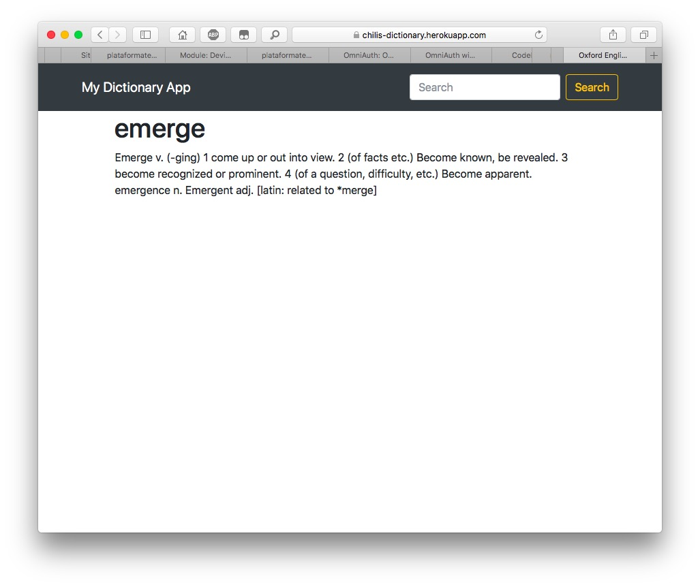

# Chili's Dictionary App

Thank you for taking a look at my dictionary web app! For this project, I wrote a single .js file which runs on a node server. I employed node's 'fs'/File System to read a .txt file to look for matches with the user's search query.

Do some searches yourself on the deployment to Heroku:
https://chilis-dictionary.herokuapp.com/?word=emerge

## Set Up
### Prerequisites
You need have node installed on your system.
### Installation
1. Clone repo
2. Run `node server.js`

## Reflection
This was the first complete web app that I created, and the first app I deployed to Heroku. I was amazed at how powerful yet minimalist Node and javascript can be.
