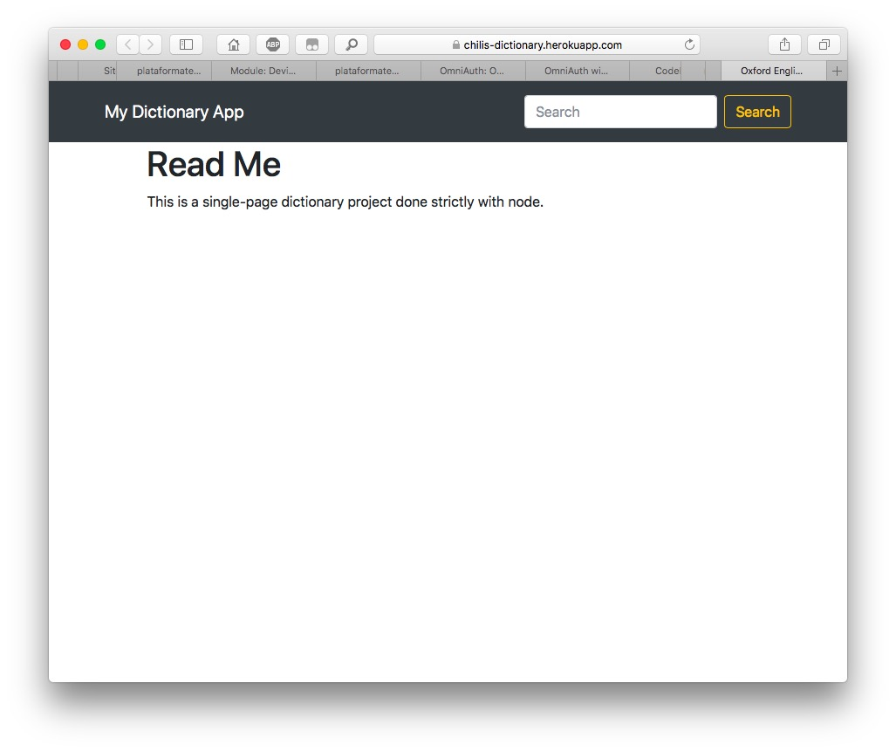

# Thanks for taking a look at my dictionary web app.

For this project, I wrote a single .js file which runs on a node server.
I employed node's 'fs'/File System to read a .txt file to look for matches with the user's search query.

Do some searches yourself on the deployment to Heroku:
https://chilis-dictionary.herokuapp.com/?word=emerge

